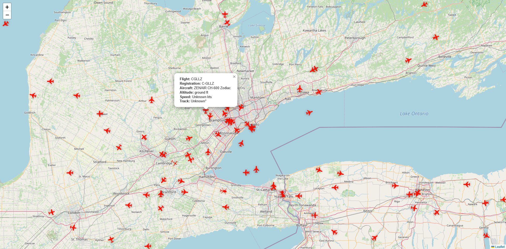

# Aero Echo

A real-time flight tracking application that displays live aircraft movements on an interactive map.



## 🚀 Features

- **Real-Time Tracking**: Watch aircraft positions update instantly with WebSocket connections
- **Global Coverage**: Track flights worldwide with extensive ADS-B network coverage
- **Live Data**: Access comprehensive flight details including altitude, speed, and heading
- **Smart Filtering**: Flight data is filtered based on map zoom level and boundaries for optimal performance
- **Responsive Design**: Works seamlessly on desktop and mobile devices

## 🛠️ Technologies Used

### Frontend

- **Next.js** - React framework for optimized performance and seamless navigation
- **Socket.IO Client** - WebSocket technology for real-time bidirectional communication
- **Tailwind CSS** - Utility-first CSS framework for styling
- **Lucide React** - Beautiful icon library

### Backend

- **Node.js** - JavaScript runtime environment
- **Express** - Web application framework for Node.js
- **Socket.IO** - Real-time event-based communication
- **ADSB.one API** - Real-time aircraft data streaming

## 📋 Prerequisites

Before you begin, ensure you have the following installed:

- Node.js (v18 or higher)
- npm or yarn
- Git

### 🔧 Installation

## ⚙️ Configuration

### Backend Configuration

Create a `.env` file in the backend directory:

```env
NODE_ENV=development
PORT=3001
```

### Frontend Configuration

Create a `.env.local` file in the frontend directory:

```env
NEXT_PUBLIC_API_URL=http://localhost:3001/api/v1
NEXT_PUBLIC_SOCKET_SERVER_URL=http://localhost:3001
```

## 🚀 Running the Application

```bash
npm run dev
```

## 📡 API Limitations

This application uses the ADSB.one API with the following constraints:

- **Coverage Radius**: Limited to 250 nautical miles from a specific location
- **Rate Limiting**: Maximum 1 request per second to the API
- **Data Caching**: Server-side global variable caching is implemented to optimize performance and respect rate limits
- **Smart Filtering**: Flight data is filtered based on map zoom level and boundaries to provide relevant information efficiently

## 🏗️ Architecture

### Data Flow

1. Backend makes requests to ADSB.one API (max 1 req/sec)
2. Flight data is cached in a global variable on the server
3. Frontend connects to backend via Socket.IO
4. Backend filters and sends relevant data based on map boundaries
5. Frontend receives real-time updates and displays aircraft on the map

### Caching Strategy

To respect the API's 1 request/second limit, the backend:

- Maintains a global cache of all aircraft data
- Updates the cache once per second
- Filters data based on client's map view
- Pushes only relevant data to connected clients

## 🤝 Contributing

Contributions are welcome! Please feel free to submit a Pull Request.

1. Fork the project
2. Create your feature branch (`git checkout -b feature/AmazingFeature`)
3. Commit your changes (`git commit -m 'Add some AmazingFeature'`)
4. Push to the branch (`git push origin feature/AmazingFeature`)
5. Open a Pull Request

## 📝 License

This project is licensed under the MIT License - see the [LICENSE](LICENSE) file for details.

## 🙏 Acknowledgments

- [ADSB.one](https://api.adsb.one) for providing free aircraft tracking data
- [Socket.IO](https://socket.io/) for real-time communication
- [Next.js](https://nextjs.org/) for the amazing React framework
- [Tailwind CSS](https://tailwindcss.com/) for the utility-first CSS framework

## 📞 Contact

Your Name - [@yourtwitter](https://twitter.com/yourtwitter)

Live Demo: [https://aeroecho.roozbehk.com/](https://aeroecho.roozbehk.com/)

## 🐛 Known Issues

- Coverage limited to 250nm radius from configured location
- API rate limiting may cause delays during high traffic
- Some aircraft may not appear if outside the coverage area

## 🔮 Future Enhancements

- [ ] Add flight path history
- [ ] Implement aircraft search functionality
- [ ] Add airport information overlays
- [ ] Create mobile app version
- [ ] Add weather layer integration
- [ ] Implement multiple location support
